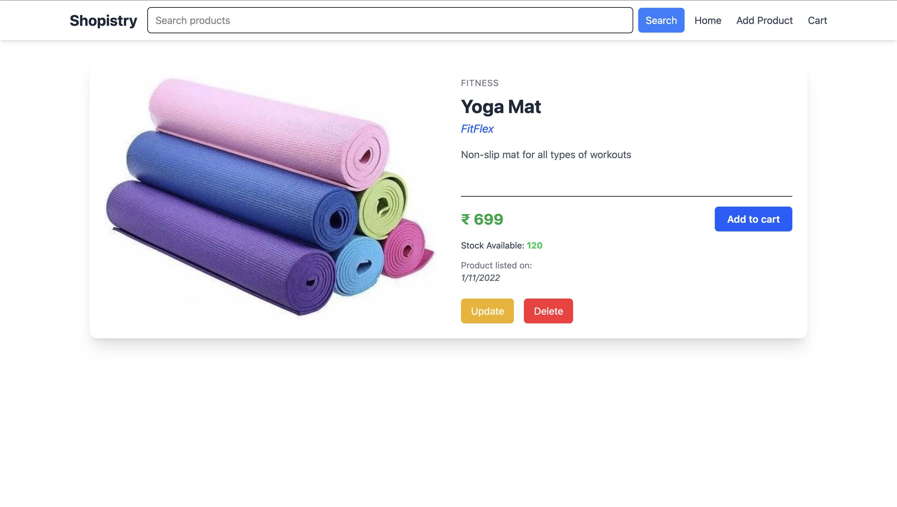

# Shopistry

A full-stack e-commerce web application built with **React**, **Spring Boot**, and **H2/MySQL**. Users can browse products, filter by categories, view product details with images, and add them to the cart.

---





## Tech Stack

### Frontend

- React + Vite
- Axios
- TailwindCSS
- React Router DOM
- Bootstrap Icons

### Backend

- Spring Boot (Java)
- Spring Data JPA
- H2 (in-memory) / MySQL (for production)
- Lombok
- Multipart File Handling for images
- CORS enabled for frontend at `localhost:5173`

---

## Getting Started

### Prerequisites

- Java 17+
- Node.js (v18+)
- Maven
- IDEs like IntelliJ / VSCode

---

## ⚙️ Backend Setup (Spring Boot)

```bash
cd backend
./mvnw spring-boot:run
```

- Runs on `http://localhost:8080`
- H2 Console: `http://localhost:8080/h2-console`  
  (JDBC URL: `jdbc:h2:mem:indulekha`, Username: `sa`, no password)
- Preloaded data in `data.sql`
- Product images are read from `src/main/resources/static/images/`

---

## 🌐 Frontend Setup (React)

```bash
cd frontend
npm install
npm run dev
```

- Runs on `http://localhost:5173`
- Calls backend APIs on `http://localhost:8080/api/...`

---

## 🖼️ Image Handling

- Images are stored as `byte[]` in the database.
- `GET /api/product/{id}/image` returns the image blob.
- Frontend uses `URL.createObjectURL(blob)` to render image dynamically.

---

## 🧪 Sample API Endpoints

| Method | Endpoint                  | Description                  |
| ------ | ------------------------- | ---------------------------- |
| GET    | `/api/products`           | List all products            |
| GET    | `/api/product/{id}`       | Get product by ID            |
| POST   | `/api/product`            | Add new product (with image) |
| GET    | `/api/product/{id}/image` | Get image for a product      |

---

## ✅ Features Implemented

- Product Listing Grid
- Image Upload + Dynamic Fetch
- Category Filtering
- Add to Cart Button (disabled if out of stock)
- Responsive UI with TailwindCSS

---

## 🔒 Future Improvements

- Add Cart Page and Checkout
- User Authentication
- Role-based Admin Panel
- Image caching or CDN
- Deploy backend with MySQL on cloud
